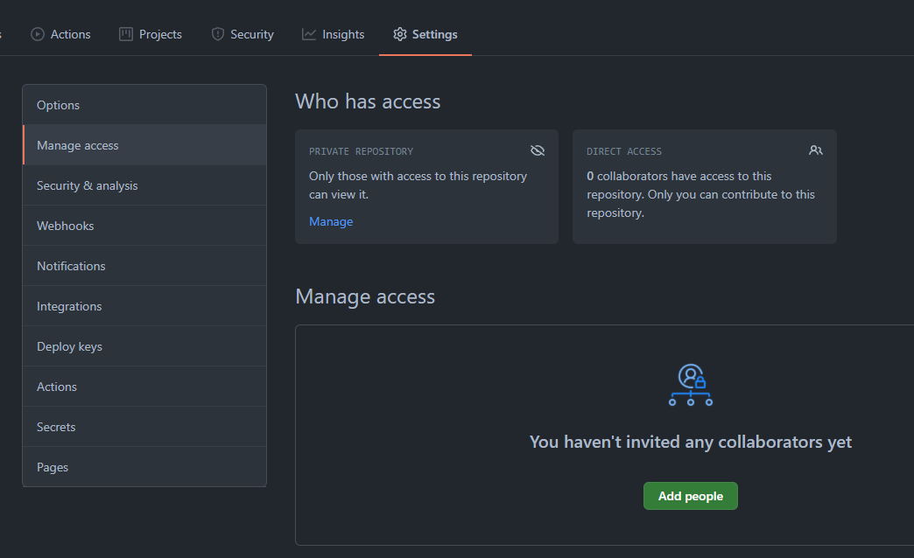

# How to Prepare your GitHub Repository

## General

In this tutorial you will create or authenticate with your GitHub Account and Fork the Code Repository in your Account.
As you will be working in a Team everyone needs to create his own GitHub Account, but only one needs to Fork the Repository and share it to the others. 

## Setup your GitHub Account

If you already have a GitHub Account you can use that one.
If not create a new one under https://github.com/

## Fork Repository

1. Open https://github.com/CapgeminiCIS/hackerkiste-2021-hackathon-dev
2. Click on Fork on the top Right Corner 
 
1. When asked where to Fork the Project Select the Default location which is most likely your Account name
2. Profit :) The Process can take a little time.

## Share the Repository

To share the Repository to everyone on your Team open the Repository select
 Settings -> Manage Access -> Add People

## Whats Next?

For the Next Step you will Setup the Connection Data between GitHub and Azure where your Resources will be Deployed.
The needed Credentials will be Provided during the Hackathon.

Continue on the [Main Page](README.md)