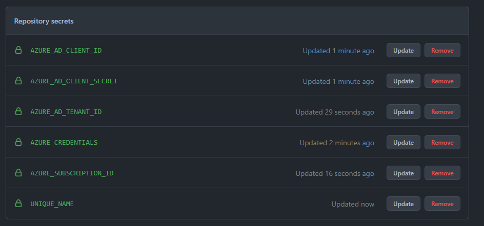

# Setup Deployment Pipeline Environment Variables

To Connect your GitHub Pipeline to Azure you will need to Provide the required Credentials. As it is a Bad idea to Store it in Plain text in the Code you should always use a seperate Key Store.
In our Example we Store the Credentials as a Repository Secret.

## How to create a Secret

https://docs.github.com/en/actions/reference/encrypted-secrets#creating-encrypted-secrets-for-a-repository

## Example Code Secrets

In our Provided Example Code we use the Following Secrets to configure our Project

To avoid name Collisions when creating our Resources on Azure in the Following Tasks, we need to create Unique Names for everyone.
Sometimes Naming Conventions  
### Prefix:

Best Practice Prefixes for Specific Azure Resources:

https://docs.microsoft.com/de-de/azure/cloud-adoption-framework/ready/azure-best-practices/resource-abbreviations

### Suffix:

We all are in the same Subscription and use same Resource Group but everybody uses his own App Service Plan and his own Webapp.

Therefore, pick unique names for your App Service Plan and Webapp variables.

You may attach your own Suffix like a short form of your name and a random Number.
If your name is Florian Peters for Example you could choose:

`flopet631`

The Resource Name would then be `plan-flopet631`

In Real Customer Environments there are usually more detailed guidelines on how to name Resources.

### AZURE_CREDENTIALS

This is the Connection Data needed for the Azure Subscription.

For this Hackathon we will provide you with it:

Secret:
AZURE_CREDENTIALS =
```
{
  "clientId": "#",
  "clientSecret": "#",
  "subscriptionId": "#",
  "tenantId": "#"
}
```

### AZURE_AD_CLIENT_ID

This is the Connection Data needed for the Azure Subscription.

For this Hackathon we will provide you with it:

Secret:
AZURE_AD_CLIENT_ID = `#`
### AZURE_AD_CLIENT_SECRET

This is the Connection Data needed for the Azure Subscription.

For this Hackathon we will provide you with it:

Secret:
AZURE_AD_CLIENT_SECRET = `#`
### AZURE_AD_TENANT_ID

This is the Connection Data needed for the Azure Subscription.

For this Hackathon we will provide you with it:

Secret:
AZURE_AD_TENANT_ID = `#`

### AZURE_SUBSCRIPTION_ID

This is the Connection Data needed for the Azure Subscription.

For this Hackathon we will provide you with it:

Secret:
AZURE_SUBSCRIPTION_ID = `#`

### UNIQUE_NAME

This is the Name for all of your resources on Azure.

Please provide a Unique Team Name it should be written all lower case, maximal 7 letter long and only contain letters. 

Examples: 
teamone
first

Secret:
UNIQUE_NAME = `#`


# Result

<br><br>

# Whats Next?

Continue on the [Main Page](README.md)