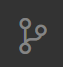
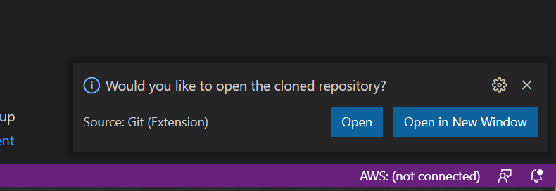
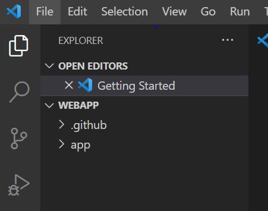
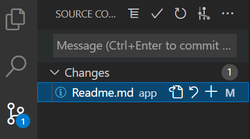
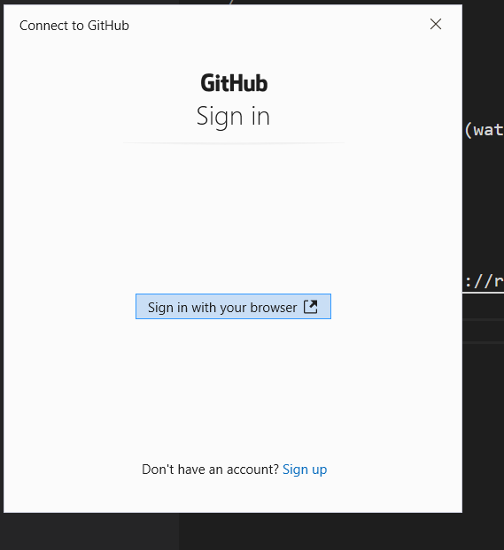

# How to work with Git

# General 

## What is Git?
Git is a version control system that developers use all over the world. It helps you track different versions of your code and collaborate with other developers. But Git is not just for code, it can be used for any kind of text document.

# Setup Git
With using Visual Studio Code (VS Code), all tools to use Git are already included and can be Found on the left side behind this symbol 

# Get Started with your Github project
In the last tutorial we used a "*fork*" to create a copy of the project in your own Github account.  

## Get your project url
In this Step we will now copy the project to your computer. Therefore we will use the "*clone*" function on Github by pressing the green **Code** button.  
 

In the clone window you can copy your *project url*
> In example https://github.com/***/azure-dev-hackathon.git

## Add project to visual studio code
When opening a new Window of Visual Studio Code you will see the *Getting Started* page which offers you the option to *Clone Git Repository...*
  

When yo u click on this option a new window will open on the top where you can enter your *project url* from Github
  

After pressing *Enter*, you will be asked where to store the project on your computer.
  

After selecting a location, your Project will be copied to your computer and VS Code will offer you in the bottom right to open the cloned project.
  

You can either open the project in the current window or open it in a new window of VS Code.

## Work with Git 

<TODO Add Text>
In the new window you will now see all files of the projects.
 

When you start working in the project, you will notice that the colour of the filenames will change to:
* Green *U* = New File
* Yellow *M*= Changed File
* Red *D*= Removed File
  
The Change of colour shows you that Git has noticed that you changed a file in the project

When you now click again on the *Git symbol* on the left, you can see a list of all changed files.
  

When you select one of the files, Git will show you the difference between the last version of the file and the current file.
  

### Create a Commit
To finally save the changes and add a new version to git you need to make a commit which contains all changed files you want to bundle together. Therefore you need to select the changes you want to add by presseing the **plus** next to the filename. All added files are then displayed in the "Stage" area.

To create a commit which contains all staged files, you need to add a **Commit Message** and press *Enter* 
  

The *Commit* saves now all the changes made in the files and can be used to revert changes if needed.

### Pushing changes to Github
To save the changes in the cloud we need to push our commits to Github. Therefor you need to click on the three dots **...** in the top right of the git window.
In this Popup you can click in *Push* to upload your changes.
  

#### Authorize in Github
To *Push* the changes, you need to login to your *Github* account. Therefore a window will popup which brings you to a *Github* login page and asks you login.
  
When you are logged into your account you will be asked if you want to connect your *Github* account with *VS Code*, which is necessary so *VS Code* can upload the changes to your project.
  
 
When it was successful you will see this screen. And you should be able to *push* your changes to *Github*.
  

After *Pushing* your *commit* you can now also see your changes in your GitHub Project.

# Glossar

* Commit => Creates a bundle of all changes with a comment of what has been changed. It can be seen of a Snapshot of the project and its always possible to revert changes by jumping back to a older commit 
* Clone => Creates a copy of a remote project repository on your local machine
* Fork => Creates a copy of a git project. The copied version can be used to create customizations on a project. Hence the copy is still connected to the original project it is always possible to apply changes and updates into your customized version of the project.
* Push => Uploads all changes that have been made on the local project to a remote location (i.e. Github)
* Pull => Downloads all changes that have been made on the remote project since the last pull. This is needed when working with multiple people on one project so you always have the newest version on your local machine.
  
# More Information

* [Git Handbook](https://guides.github.com/introduction/git-handbook/)
* [Git Cheat Sheet](https://about.gitlab.com/images/press/git-cheat-sheet.pdf)

