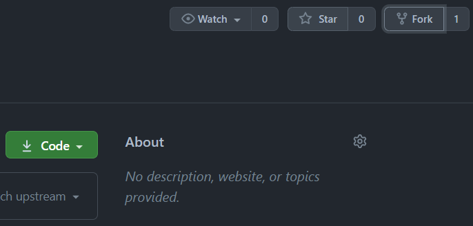

# How to Prepare your GitHub Repository

## General

Please Setup your GitHub Account before the Hackathon and feel free to Contact us if you need any Help during the Process.

## Setup your GitHub Account

If you already have a GitHub Account you can use that one.
If not create a new one under https://github.com/

## Fork Repository

1. Open https://github.com/DevOps-Gilde/webapp
2. Click on Fork on the top Right Corner 
 
1. When asked where to Fork the Project Select the Default location which is most likely your Account name
2. Profit :) The Process can take a little time.

## Whats Next?

For the Next Step you will Setup the Connection Data between GitHub and Azure where your Resources will be Deployed.
The needed Credentials will only be Provided during the Hackathon.