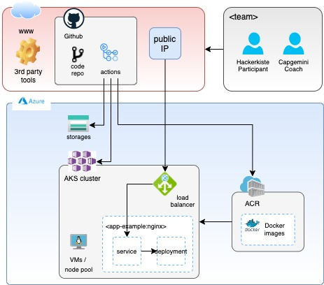

# Capgemini Hackathon for the Hackerkiste 2022
Welcome to Capgemini's hackathon for the [Hackerkiste 2022](https://2022.hackerkiste.de). All hints are provided in this repository. If you need any assistance at any point, do not hesitate to ask us. We are here to help you.

The following architecture overview displays the services you will provision during this Hackathon (on the left hand side of the box labelled 'Azure').

 

## 0 Prerequisites
To get started you need to fulfil the following prerequisites. Please follow the instructions step by step:

1. Assign to a team
2. Install IDE on your computer (e.g. [Visual Studio Code](https://code.visualstudio.com/))
3. Everyone should have a GitHub account. Create your own [Github Account](https://Github.com/) if you do not have one yet. You can follow our instructions on [How to Prepare your Github Repository](01_SetupGitHub.md).
5. Assign a leader in your team.
4. The leader should fork the repository [Setup Github](01_SetupGitHub.md).
6. Use your Github account and share the leaders code repository to everyone in the team. There should be only one shared GitHub repository so everyone has access to the same code and secrets.
7. Clone the code [Setup Git in your IDE](02_SetupGit.md)
8. [Setup your Secrets](03_SetupGitHubActionSecrets.md)
9. Receive your user account to the Azure subscription
10. Test your access to the Azure subscription (https://portal.azure.com)
11. We agreed to use [Visual Studio Code](https://code.visualstudio.com/). Please also install the [Live Share](https://marketplace.visualstudio.com/items?itemName=MS-vsliveshare.vsliveshare) extension and use it :)

## Let the Hacking Begin
All steps and hints are provided in the corresponding `Readme` files. The Hackathon is divided into several stages which build upon each other:

1. Stage 1: Creating your initial infrastructure on Azure [Stage 1 AKS Cluster](04_Stage_1_AKS_Cluster.md)
2. Stage 2: Managing your inbound traffic [Stage 2 AKS Cluster](05_Stage_2_Ingress.md)
3. Stage 3: Hosting your first container [Stage 3 Single Container](06_Stage_3_SingleContainer.md)
4. Stage 4: Create your own infrastructure [Stage 4 Frontend_Backend](07_Stage_4_Frontend_Backend.md)
